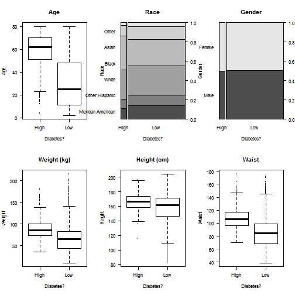

## Problem Statement

* Estimated 23.6 million patients in US and is the 7th leading cause of death.
* Risk awareness lead to better self-management.
* Therefore, this application aims to preliminarily assess Diabetes risk from their basic info such as ages, gender, etc..

--- .class #id 

## About the Dataset

* National Health and Nutrition Examination Survey (NHANES) 2011-2012
* 2 years survey by National Center for Health Statistics
* Contain demographical, behavioral, laboratory, and dietary data vs their Health data (various disease & problems).
* This project will focus on basic info such as ages and gender vs their diabetes health profile.

--- .class #id 

## Exploratory Analysis

 

--- .class #id 

## Work Flow

* Import data tables (SAS XPT) into R
* Merge data tables by matching ID
* Data preprocessing
* Fit and Evaluate models
* Create App that take user input to fit into the model

--- .class #id 

## Findings and Discussion

* Age, waist circumference and Ethnicity has high impact on Diabetes risks.
* There are some laboratory and questionnaire data featured in the NHANES survey which might be useful to improve the model.
